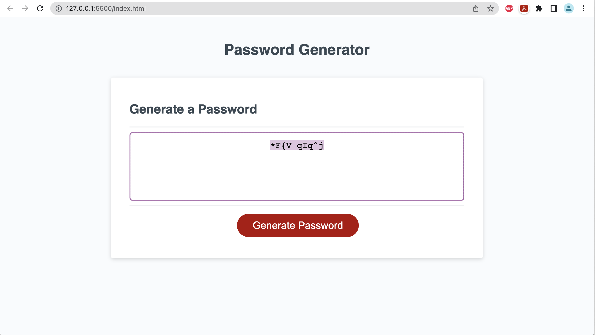

# password-generator-web-app

## Description

This web application is a randomized password generator tool that enables users to generate random passwords based on criteria they’ve selected. This app is supported on desktop, tablet, and mobile devices on conventional browsers.

## Installation

N/A

## Usage

To use the deployed web application, click on the 'Generate Password' button to launch a wizard that will guide the user through the process of generating a random password. At the end of the wizard, the password will be displayed in the textbox above the 'Generate Password' button and will be conveniently  highlighted for an easier copying experience.

## Credits

Credit to the TA's and students at UCF coding bootcamp for advice and guidance.

## Links

Deployed Application:

## Screenshots

## License

Please refer to the LICENSE in the repo.

